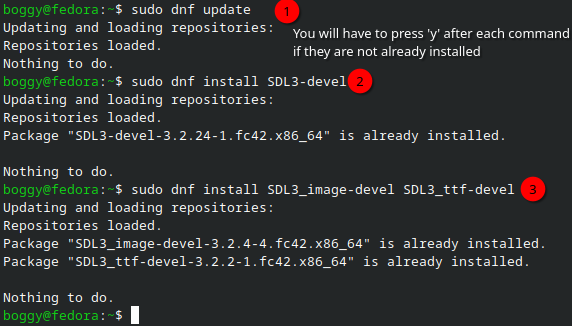
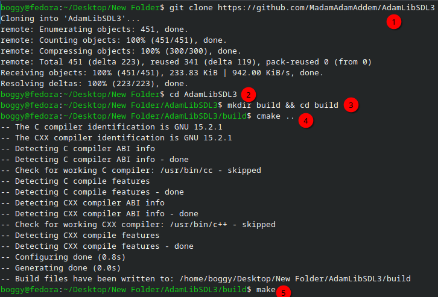
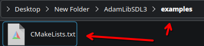
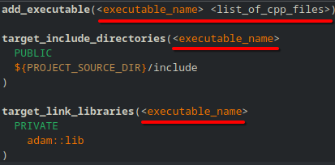
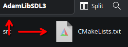
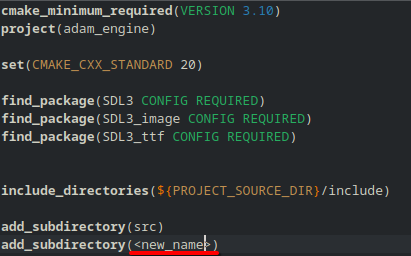
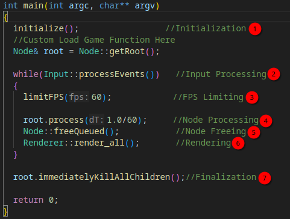
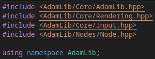
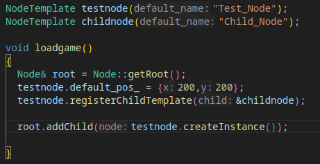
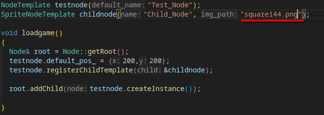

# AdamLibSDL3
## Introduction
AdamLib is a game development library written with the intention of allowing fast development with no supplimentary scripting language. An easy interface is provided allowing fast production of reuseable scenes. Built-in cross-compatibility for most desktop, mobile, console, and web platforms is provided.    

This engine is not intended for use/installation of beginners to programming or C++, as a moderate amount of knowledge is needed to set-up and use this library properly. 

## Pre-requisites to use
A C++ compiler, CMake, and git are required to build, compile, and use this library. A package manager is required to install dependencies. An IDE is strongly recommended but not required.  

## Step 1: Installing dependencies
The library at present date requires three external libraries to be installed: SDL3, SDL3_image and SDL3_ttf. Different instructions are given for the currently supported platforms, Windows and Linux.    

### Windows
Ensure you have the MSYS2 package manager installed. Using the command-line interface, enter the following commands to install the required dependencies:  
>pacman -S mingw-w64-x86_64-sdl3  
>pacman -S mingw-w64-x86_64-sdl3-image  
>pacman -S mingw-w64-x86_64-sdl3-ttf  

Once completed, you may proceed directly to Step 2.    

### Linux
All linux operating systems should be equipped with a package manager. 
These can install the libraries directly to your system using the command line interface.    

For the apt package manager, type the commands as shown into the command line  
> sudo apt update  
> sudo apt install libsdl3-dev 
> sudo apt install libsdl3-image-dev libsdl3-ttf-dev 

 

For the yum/dnf package manager, the commands are as shown 
> sudo dnf update  
> sudo dnf install SDL3-devel  
> sudo dnf install SDL3_image-devel SDL3_ttf-devel 

 

#### Example for the dnf manager:  

---
  
---

 

## Step 2: Building and Compiling
Once you've installed the prerequisite dependencies open the command line and input the following command.

#### Warning: Ensure you're in a folder that does not contain another folder with the name 'AdamLibSDL3', as this following command may be destructive if so  
>git clone https://github.com/MadamAdamAddem/AdamLibSDL3  

 

Then, Build and Compile using the following commands:
>cd AdamLibSDL3  
>mkdir build && cd build  
>cmake .\.  
>make  

#### Example output:  
---
  
---
 
After some time compiling, the library will be ready for use!    

## Step 3: Setting up your project with AdamLib

The following steps show how to set up your project within the AdamLib directory. Other set-ups are possible, but are not within the scope of this tutorial.  

### Configuring CMake
Let **\<new_name\>** represent the name of your project.  
Let **\<executable_name\>** represent the name of your executable.  
Let **\<list_of_cpp_files\>** represent a space-seperated list of the c++ files you wish to compile.  

#### Locate and open the CMakeLists.txt file found at *AdamLibSDL3/examples/CMakeLists.txt*  

---
  
---

 

#### Modify the file such that it looks like this image, with your project's specifics replacing the **\<representations\>**.  

---
 
---

 

#### Once completed, replace the name of the *examples* folder with **\<new_name\>**, then locate and open the CMakeLists.txt file found at *AdamLibSDL3/CMakeLists.txt*  

---
  
---

 

#### Modify the file such that it looks like this image replacing **\<new_name\>**.  

---
  
---

 

### Configuring your IDE
After configuring the CMake files, open the AdamLibSDL3 folder in your IDE of choice.   
Enter the IDE's settings and set the *include/AdamLib* directory to be a registered include directory.  
Since there are many different IDE's, no specifics can be provided; there should be instructions available online.   

### Compiling your project
Once done configuring, simply repeat the Building and Compiling steps mentioned in Step 2.  
If you'd like to recompile without rebuilding, type *make* into the build directory.    

## Step 4: Creating a main file

There should exist three files within what was previously the examples directory:  
>main.cpp, test.hpp, and testgame.cpp

You may read or use these files, but for the sake of this tutorial we will consider them to be deleted.    

### Setting up the main loop
Create your file that will contain the main function, and define it. 
There are seven parts to a main function with AdamLib:  
>Initialization (1) 
>Input processing (2) 
>FPS Limiting (3) 
>Node processing (4) 
>Node freeing (5) 
>Rendering (6) 
>Finalization (7) 

#### Each of these parts has a corresponding function. The following image shows how these can be used simply.  

---
  
---

 
Most main loops will look exactly like this, with the game loading function being the only variation point. Ensure the headers are included like so:  

---
  
---

 

### Setting up your game skeleton
AdamLib functions using a **Node Tree**. Put simply, Nodes are the objects that exist within the world.  

These objects can have children, which move as the parent object moves, while maintaining their relative position.  

To create a Node, we must first create a **Node Template** to describe the qualities of the node, such as its name, default position, and what child nodes it will have. Then, when ready, we can create an instance of the node by placing it as a child of the Root node. 

Here is an example of just that:  
  

There exist multiple types of Node with different properties. For example, the SpriteNode contains an image which will be displayed on screen at the SpriteNode's position. To create one, use the corresponding NodeTemplate type and add the relative path to your image.  

  

## Finishing Remarks
When run, you should see your image display with the top left corner at x: 200, y: 200.  

Much more functionality is offered by the library, but this tutorial intends to teach you the basics. Use the intellisense offered by your IDE to scour for functions that may suit your interests, or check out the headers within the */include* Directory for more informaton.  